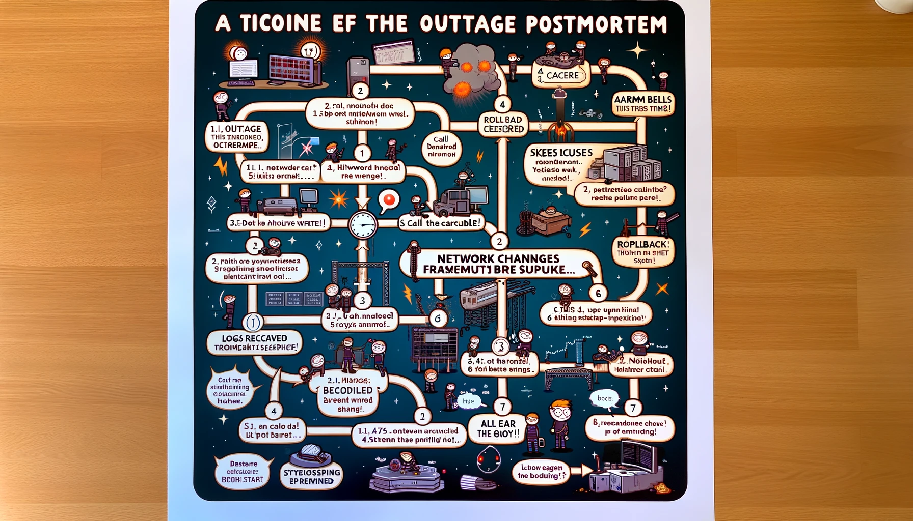

# Postmortem: Database Outage on April 25, 2024

## Issue Summary
On April 25, 2024, from 14:00 to 17:30 GMT, our main customer service portal experienced a significant outage affecting approximately 75% of our user base. During this period, users were unable to access our ticket submission system, resulting in increased support calls and customer dissatisfaction. The root cause was identified as a failed database upgrade leading to a cascading failure in the service handling user requests.

## Timeline

- **14:00 GMT**: Outage detected by monitoring system - \"Alarm Bells Ring!\"
- **14:05 GMT**: Incident reported to SRE team - \"Call the Cavalry!\"
- **14:20 GMT**: Network issue hypothesis discarded - \"Not the Firewall This Time\"
- **14:45 GMT**: Database changes under suspicion - \"Schema Trouble Brewing...\"
- **15:30 GMT**: Logs reviewed, pinpointing failed upgrade - \"Found the Culprit!\"
- **16:15 GMT**: Recovery initiated by rolling back to pre-upgrade state - \"Rollback Time!\"
- **17:30 GMT**: System declared stable, outage ended - \"All Clear Now!\"

## Root Cause and Resolution
The outage was caused by an incomplete database schema migration during an upgrade, which left the database in an inconsistent state. This caused failures in data retrieval by the user authentication service, which in turn led to widespread service disruptions. The issue was resolved by rolling back the database to its previous stable state and then reapplying the upgrade with the correct migration scripts.

## Corrective and Preventative Measures
To prevent such occurrences in the future and improve our response, we plan to implement the following measures:
- **Enhance our monitoring system** to include checks for database integrity post-upgrade.
- **Review and update our deployment procedures** to include additional automated checks before and after database upgrades.
- **Conduct a thorough review of recent changes** to ensure no other systems are at risk.
- **Schedule a series of drills** for the team to practice incident response scenarios.

## Engaging Elements
- **Humor**: “They say what doesn’t kill you makes you stronger—except for database outages, those just give you a headache.”

## Repository Details
- **Repo URL**: [GitHub Repository: alx-system_engineering-devops](https://github.com/MoSalem149/alx-system_engineering-devops)
- **Directory**: `0x19-postmortem`
- **File**: `README.md`
